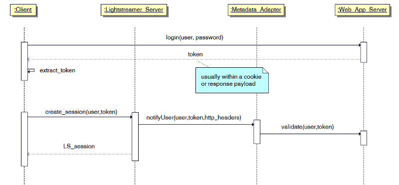

# Lightstreamer - Authentication and Authorization Demo - Java Adapter

The Lightstreamer Authentication and Authorization Demo is a simple example illustrating authentication and authorization mechanisms when an external 
Web/Application Server is involved in the process.

This project includes a simple MetadataProvider implementation that includes user validation and items authorization logics.


## Details

This *Authentication and Authorization Demo* illustrates the typical best practice used for Lightstreamer Web applications, when a Web/Application server is involved in the process. 
The actual authentication is usually handled by the legacy Web/Application server, irrespective of Lightstreamer. 
Some sort of token is sent back to the Client through cookies, response payload or any other technique. 
When the Web Client creates the Lightstreamer session, instead of sending again the full credentials (usually involving a password) to 
Lightstreamer Server, it sends just the username and the token.
The Metadata Adapter is passed this information and validates the token against the Web/Application Server that 
generated it (or a database or whatever back-end system).

Here an overview of the whole sequence:



In this demo client the Web/Application server is not actually involved and calls to placeholder methods are performed to validate the tokens.

from `src/authmetadata_demo/adapters/AuthMetadataAdapter.java`:
```java
[...]

if (!AuthorizationRequest.isValidToken(user, token)) {
    throw new AccessException("Invalid user/token");
}
  
[...]
```

This demo also implements Authorization handling of item subscription requests.
Every time a subscription is issued, the adapter verifies if the user issuing the request is actually authorized to subscribe to the selected item(s).
Again, a real case might query an external service to verify the user authorizations; this demo example simply checks on an hard-coded list

from `src/authmetadata_demo/adapters/AuthMetadataAdapter.java`:
```java
[...]

if (!AuthorizationRequest.canUserSeeItems(user, items)) {
    throw new CreditsException(-1, "User not authorized", "You are not authorized to see this item"); 
}

[...]
```

Querying an external service at subscription time is a discouraged approach though. If the authorizations are actually placed on an external service,
it is suggested to use the approach shown in the `AuthMetadataAdapterWithAuthCache` class where authorizations are queried at session startup and cached
in the adapter.

More details and comments on how the auth/auth cycle is accomplished is available in the source code of the application.


### The Adapter Set Configuration

This Adapter Set is configured and will be referenced by the clients as `AUTHDEMO`. 

* The project includes two different MetadataProvider implementations; replace `AuthMetadataAdapter` with `AuthMetadataAdapterWithAuthCache` to use
the alternative version.
* The project relies on the StockQuotesDataAdapter class as DataProvider implementation. This class is part of the 
[Stock-List Demo - Java Adapter](https://github.com/Lightstreamer/Lightstreamer-example-StockList-adapter-java) project.

The `adapters.xml` file for the *Authentication and Authorization Demo*, should look like:

```xml      
<?xml version="1.0"?>

<adapters_conf id="AUTHDEMO">

    <metadata_provider>
    
        <adapter_class>authmetadata_demo.adapters.AuthMetadataAdapter</adapter_class>

        <!-- use a dedicated pool for notifyUser call, see source code of AuthMetadataAdapter -->
        <authentication_pool>
            <max_size>1000</max_size>
            <max_free>10</max_free>
        </authentication_pool>
        
    </metadata_provider>

    <data_provider name="QUOTE_ADAPTER">
    
        <!-- this class is taken from the Stock-List Demo - Java Adapter project-->
        <adapter_class>stocklist_demo.adapters.StockQuotesDataAdapter</adapter_class>
        
    </data_provider>

</adapters_conf>
```

<i>NOTE: not all configuration options of an Adapter Set are exposed by the file suggested above. 
You can easily expand your configurations using the generic template, see the [Java In-Process Adapter Interface Project](https://github.com/Lightstreamer/Lightstreamer-lib-adapter-java-inprocess#configuration) for details.</i><br>
<br>
Please refer [here](https://lightstreamer.com/docs/ls-server/latest/General%20Concepts.pdf) for more details about Lightstreamer Adapters.

## Install 

If you want to install this Demo in your local Lightstreamer Server, follow these steps.

* Download Lightstreamer Server (Lightstreamer Server comes with a free non-expiring demo license for 20 connected users) from Lightstreamer Download page, 
and install it, as explained in the `GETTING_STARTED.TXT` file in the installation home directory.
* Make sure that Lightstreamer Server is not running.
* Get the `deploy.zip` file from the [latest release](https://github.com/Lightstreamer/Lightstreamer-example-AuthMetadata-adapter-java/releases), unzip it, and copy the `AuthDemo` folder into the `adapters`
folder of your Lightstreamer Server installation.
* Launch Lightstreamer Server.

## Build

To build your own version of `example-AuthMetadata-adapter-java-x.y.z-SNAPSHOT.jar` instead of using the one provided in the `deploy.zip` file from the [Install](#install) section above, you have two options:
either use [Maven](https://maven.apache.org/) (or other build tools) to take care of dependencies and building (recommended) or gather the necessary jars yourself and build it manually.
For the sake of simplicity only the Maven case is detailed here.

### Maven

You can easily build and run this application using Maven through the pom.xml file located in the root folder of this project. As an alternative, you can use an alternative build tool (e.g. Gradle, Ivy, etc.) by converting the provided pom.xml file.

Assuming Maven is installed and available in your path you can build the demo by running
```sh 
 mvn install dependency:copy-dependencies 
```

## See Also

### Clients Using This Adapter

[Follow this link for a list of clients for this adapter](https://github.com/Lightstreamer?utf8=%E2%9C%93&q=Lightstreamer-example-authmetadata-client)

### Related Projects

* [LiteralBasedProvider Metadata Adapter](https://github.com/Lightstreamer/Lightstreamer-lib-adapter-java-inprocess#literalbasedprovider-metadata-adapter)

## Lightstreamer Compatibility Notes

- Compatible with Lightstreamer SDK for Java In-Process Adapters since 7.3.
- For a version of this example compatible with Lightstreamer SDK for Java Adapters version 6.0, please refer to [this tag](https://github.com/Lightstreamer/Lightstreamer-example-AuthMetadata-adapter-java/tree/first-release).